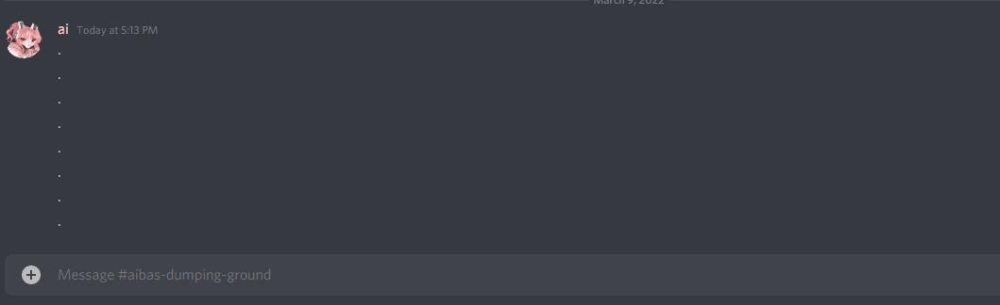

# Ai Bot Public
Ai Bot is a discord bot aimed to help digital creators verify the purchases of the customers inside discord servers.

## Table Of Contents
- [Gumroad Requirements](#gumroad-requirements)
- [Server Setup](#server-setup)
- [Product Commands](#product-commands)
- [Verify Purchase Command](#verify-command)
- [Integration Commands](#integration-commands)
- [Discount Commands](#discount-commands)
- [Redeem Discount Command](#redeem-command)

## Gumroad Requirements
In order for license keys to be generated for uses, ensure that the `Generate a unique license key per sale` option is enabled on all of your products. If you don't have it  enabled, enabling it should generate a license key for all previous sales, so don't worry if you don't have it set yet. More info about license keys [here](https://help.gumroad.com/article/76-license-keys).

Users can find their license key on the download page of their product. If they don't have a gumroad account they can fill out the form on this page [https://app.gumroad.com/license-key-lookup](https://app.gumroad.com/license-key-lookup).

## Server Setup
### Invite to Server
Ai Bot is not publically available yet. To get updates, join the discord server: [https://discord.com/invite/bM7nw7XQyk](https://discord.com/invite/bM7nw7XQyk)

### Permissions Setup
After you add the bot to your server there are a couple of things you will need to do to get the bot working.
1. By default, only the server owner can run the product commands. If you want other admins to be able to add/edit/remove products, run the `/set-admin-role` command to select an admin role.
2. Ensure the `Ai Bot` role is above all other roles. If a user has a role that is higher than the `Ai Bot` role then the bot will not be able to add a role to that user. Please note that the bot will not be able to add roles to the server owner regardless of permissions.
3. Ensure all roles that you want to have access to the `/verify` command have the `Use Application Commands` permission.
4. Ensure all channels that you want to have access to any slash command has the `Use Application Commands` permission.

# Usage

When using commands, make sure you press tab to move to the next argument.

## Product Commands
A product is an item that a discord user can verify against. Users can verify products using the [verify command](#verify-command).
### Add a New Product
`/product add <platform> <product-name> <product-code> <avatar-role> <product-variant>`

This command is used to add a new product. Once added, users can run `/verify` to verify a purchase against this product.

The arguments for this command are:
- `platform`: The platform that your product is being sold on. Currently, only Gumroad is supported.
- `product-name`: This is what the users will see in the dropdown when they run `/verify`. Spaces are allowed.
- `product-code`: This is the gumroad product url code. To find it, open up the product and look at the url. The gumroad url structure is as follows: `https://<gumroad-username>.gumroad.com/l/<product-code>`. So if your  url is `marivr.gumroad.com/l/XuigQ`, your `product-code` is `XuigQ`.
- `avatar-role`: This is the role that users will get when they verify your product.
- `variant` (optional): This is an optional field. Leave blank if you don't use Gumroad variants, or you don't want to distinguish between variants. If your variant is `Commercial License` then enter `Commercial License`. Spaces are allowed. Each variant should be entered as a separate product if they require different roles.

### Edit an Existing Product
`/product edit <product> <platform> <product-name> <product-code> <avatar-role> <product-variant>`

This command is the same as  `/product add` but with an additional first field to select what product to edit. You must re-enter all fields again, otherwise they will be set to blank. If you want to remove a variant, then click on the variant field and leave blank.

### Deleting a Product
`/product delete <product> <confirmation>`

This commands deletes a product. Just select the product you want deleted, and confirm you want it deleted.

## Verify Command

### Verifying a Purchase
`/verify <avatar> <key>`

This command verifies a product purchase for a user.

## Integration Commands
Integrations will allow us to use 3rd party APIs like Gumroad & PayHip.

### Add a New Integration
`/integration add <platform> <name> <access-token>`
- `platform`: The platform this integration is for. Gumroad or PayHip.
- `name`: A user-friendly name for the integration. For display purpose only.
- `access-token`: The access token for the integration. To generate an access token, please follow these guides.
    - Gumroad: [https://help.gumroad.com/article/280-create-application-api](https://help.gumroad.com/article/280-create-application-api)
    - PayHip: Coming soon...

### Edit an Existing Integration
`/integration edit <integration> <platform> <name> <access-token>`
- `integration`: The integration you wish to edit.
- `platform`: The platform this integration is for. Gumroad or PayHip.
- `name`: A user-friendly name for the integration. For display purpose only.
- `access-token`: The access token for the integration. To generate an access token, please follow these guides.

### Delete an Integration
`/integration edit <integration> <platform> <name> <access-token>`
- `integration`: The integration you wish to delete.
- `confirmation`: Confirm you really want to delete the integration.

## Discount Commands
Before you create a discount, ensure you have an integration set up for Gumroad. Docs for it [here](#integration-commands). This is because in order for the bot to create discount codes on your behalf, it'll need to be able to authenticate to your account.

### Add a Discount
`/discount add <product> <integration> <avatar-role> <name> <offer-type> <amount> <max-generated-codes> <max-user-generated-codes> <max-uses> <expires-at>`
- `product`: The product the discount is for.
- `integration`: The integration that will be used to generate the discount.
- `avatar-role`: The role that will have access to the discount. Currently, you can only select one role. In the future I hope to make this a multi select.
- `name`: The display name of the discount. This is what users will see when calling the `/redeem` command.
- `offer-type`: Either "Amount Off" or "Percentage Off".
- `amount`: The discount amount. If `offer-type` is "Percentage Off", value must be between 1-100. If `offer-type` is "Amount Off", must be a whole positive number above 0.
- `max-generated-codes` (optional): The max amount of discount codes that can be generated across all users. If empty, there will be no limit.
- `max-user-generated-codes` (optional): The max amount of discount codes that a user can generate using the `/redeem` command. If empty, the user will be able to generate as many as they want.
- `max-uses` (optional): The max amount of times that a generated discount code can be used. If empty, there will be no limit.
- `expires-at` (optional): The deadline for generating discount codes. This value is a timestamp that can be generated at [timestampgenerator.com](https://timestampgenerator.com). If empty, the discount will never expire.

### Edit a Discount
Only a limited number of fields can be edited for discounts.
`/discount edit <discount> <avatar-role> <name> <max-generated-codes> <expires-at>`
- `discount`: The discount you want to edit.
- `avatar-role`: The role that will have access to the discount. Currently, you can only select one role. In the future I hope to make this a multi select.
- `name`: The display name of the discount. This is what users will see when calling the `/redeem` command.
- `max-generated-codes` (optional): The max amount of discount codes that can be generated across all users. If empty, there will be no limit.
- `expires-at` (optional): The deadline for generating discount codes. This value is a timestamp that can be generated at [timestampgenerator.com](https://timestampgenerator.com). If empty, the discount will never expire.

### Delete a Discount
`/discount delete <discount> <confirmation>`
- `discount`: The discount you wish to delete.
- `confirmation`: Confirm you really want to delete the discount.

## Redeem Command
### Redeem a discount
`/redeem <discount>`
- `discount`: The discount you want to redeem.
